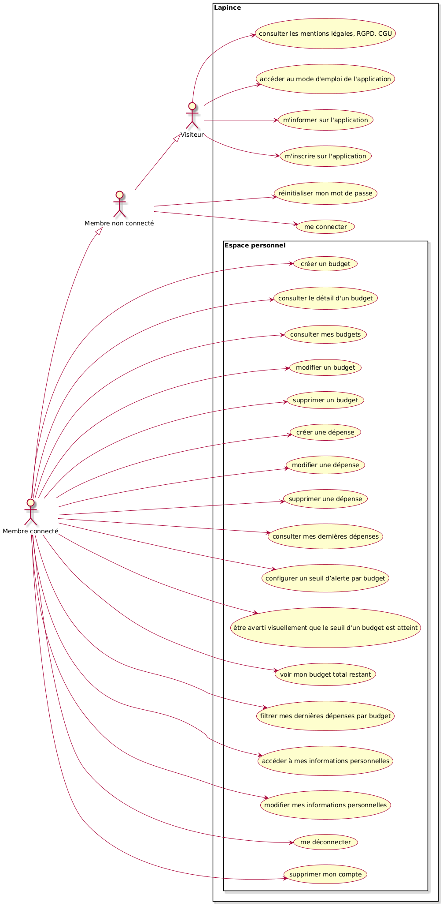

# Uses cases

Réalisés sur plantUML : https://plantuml.com/fr/
### Cas d'utilisation de l'application "La Pince"



```bash
@startuml
skin rose
left to right direction

actor "Visiteur" as V
actor "Membre non connecté" as MNC
actor "Membre connecté" as M

M --|> MNC
MNC --|> V

rectangle "Lapince"{
Usecase "m'informer sur l'application" as UC1
Usecase "accéder au mode d'emploi de l'application" as UC2
Usecase "consulter les mentions légales, RGPD, CGU" as UC3
Usecase "m'inscrire sur l'application" as UC4

Usecase "réinitialiser mon mot de passe" as UC5
Usecase "me connecter" as UC6

rectangle "Espace personnel" {
Usecase "créer un budget" as UC7
Usecase "consulter le détail d'un budget" as UC8
Usecase "consulter mes budgets" as UC9
Usecase "modifier un budget" as UC10
Usecase "supprimer un budget" as UC11
Usecase "créer une dépense" as UC12
Usecase "modifier une dépense" as UC13
Usecase "supprimer une dépense" as UC14
Usecase "consulter mes dernières dépenses" as UC15
Usecase "configurer un seuil d’alerte par budget" as UC16
Usecase "être averti visuellement que le seuil d'un budget est atteint" as UC17
Usecase "voir mon budget total restant" as UC18
Usecase "filtrer mes dernières dépenses par budget" as UC19
Usecase "accéder à mes informations personnelles" as UC20
Usecase "modifier mes informations personnelles" as UC21
Usecase "me déconnecter" as UC22
Usecase "supprimer mon compte" as UC23

}

}

V --> UC1
V --> UC2
V --> UC3
V --> UC4

MNC --> UC5
MNC --> UC6

M --> UC7
M --> UC8
M --> UC9
M --> UC10
M --> UC11
M --> UC12
M --> UC13
M --> UC14
M --> UC15
M --> UC16
M --> UC17
M --> UC18
M --> UC19
M --> UC20
M --> UC21
M --> UC22
M --> UC23
@enduml
```

**Lien plant UML :**  
//www.plantuml.com/plantuml/png/ZPHDRjiy48RtFCN0csnYm99_uco20Fa-PDCKHO5upqXZTr2IKcUeRDe2lKPtNTQzXcxIavHIPD4scAA01RoIddT-PapTYjVi6skKV2G7N0agWriFlWActGSF9J4MdYgdb2vynJ3Pa937XYUW1JQ7fmzednZ1LGwAohdWQVSzyV3sxemvUw_K0qodNsvwCbmlDnkbkiJQxGp2v8skoHKu-QmU1GijuP6z8BUjs2A3D0pcGjUreK9tjVQ17--oIEkYQFTbO7K3jYeHoWkqjQa8Wavvy-WDzKfZV30R5B3eEap0jFkTDYYNyFx-tN-NS7V_E7ZdfrLAmSJuQfKB5N5kz-J8apOao60h5oxVrLXh4HmSosYmupYHXxUhaydzBxKkWXrPEivCu6Y6HSY738s3fwRSeHyYNALxXxBTUqqcpExSiKuvBCf0oO1THomiWRQKI9xD8YHDNJFP59KbkkWhhD497gWyaJ35pHCva-3YjKPBP4VjJqOPFN8mBKzCMzer_DAIODEDy_UtxzeW-sxBVDRdAdhRNvuHz7CW2Pv96ZG6BJeFdne4WuTmSJk0ua5xZ-J6W4VBVQw8mLOZxIkl3N0mwSYl8xybu_al_IRAlquSmVP77-7b-FOdGUB_qunZosU9vVsJCJiozYiyFo9vdjgtxRzTjlPumEPAVUr_6vXERxf-HfMFQZwgXHg-NztDyaYlmej1NergFQhhKMMpABCeyoZdKIwYN4QvYl8godMKCLi-YpABCezohcxHbOqrVm00


