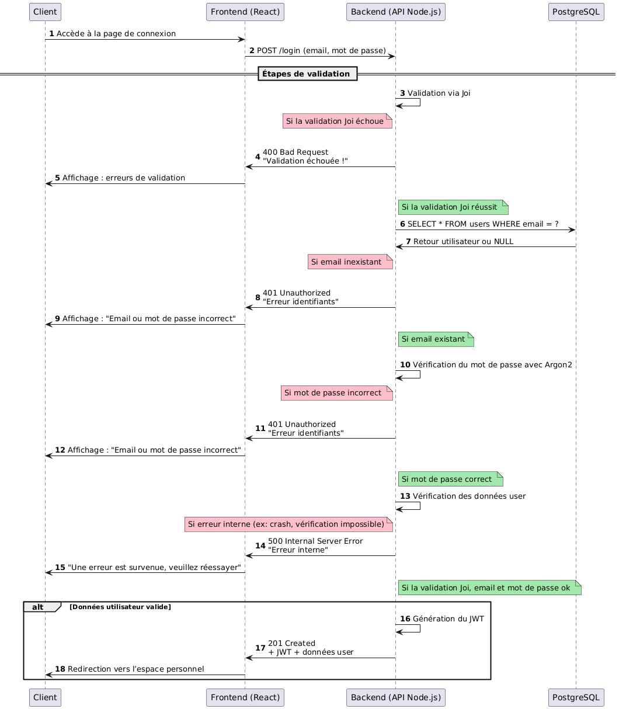

# Diagramme de séquence

Réalisés sur plantUML : https://plantuml.com/fr/
### Diagramme de séquence d'authentification




```bash
@startuml
autonumber

participant "Client" as Client
participant "Frontend (React)" as Frontend
participant "Backend (API Node.js)" as Backend
participant "PostgreSQL" as PostgreSQLa

Client -> Frontend: Accède à la page de connexion
Frontend -> Backend: POST /login (email, mot de passe)

== Étapes de validation ==

Backend -> Backend: Validation via Joi
note left of Backend #pink
Si la validation Joi échoue
end note

alt Données invalides (Joi)
Backend -> Frontend: 400 Bad Request\n"Validation échouée !"
Frontend -> Client: Affichage : erreurs de validation
else Données valides
note right of Backend #a0e9aa
Si la validation Joi réussit 
end note

Backend -> PostgreSQL: SELECT * FROM users WHERE email = ?
PostgreSQL -> Backend: Retour utilisateur ou NULL
note left of Backend #pink
Si email inexistant 
end note
alt Utilisateur non trouvé
Backend -> Frontend: 401 Unauthorized\n"Erreur identifiants"
Frontend -> Client: Affichage : "Email ou mot de passe incorrect"

note right of Backend #a0e9aa
Si email existant
end note
else Utilisateur trouvé
Backend -> Backend: Vérification du mot de passe avec Argon2
note left of Backend #pink
Si mot de passe incorrect 
end note
alt Erreur pendant la vérification

Backend -> Frontend: 401 Unauthorized\n"Erreur identifiants"
Frontend -> Client: Affichage : "Email ou mot de passe incorrect"


else Mot de passe correct
note right of Backend #a0e9aa
Si mot de passe correct 
end note
Backend -> Backend: Vérification des données user


note left of Backend #pink
Si erreur interne (ex: crash, vérification impossible)
end note
Backend -> Frontend: 500 Internal Server Error\n"Erreur interne"
Frontend -> Client: "Une erreur est survenue, veuillez réessayer"

note right of Backend #a0e9aa
Si la validation Joi, email et mot de passe ok 
end note
alt Données utilisateur valide
Backend -> Backend: Génération du JWT
Backend -> Frontend: 201 Created\n+ JWT + données user
Frontend -> Client: Redirection vers l’espace personnel
end
@enduml
```

**Lien plant UML :**  
//www.plantuml.com/plantuml/png/nLJBSjCm5DthAovcaz02fGCBCXDeAIcqapv86hfXezetYQWY6JqofIksV08xbkGx_2Ty2TTsN4V1J1WsR3AsT7nq7ZVQiuuRvsUISU-qyhChD8obj2PYaNBb83gG0fMBW5ie7yFjGwELGvL0Qu0yTkq2M2s6q5SylYwG--T7SAeJVFJHblZbJWW_rzPD30xVzGjC_SfOAGGUlhWxgGFxSPpzI12oxo0vf7o2G6-nLWflX5QiGj9NrNaTE3yRNi1ZgIT2GGjdNCXjc6cNVvboQx7DMBSBsLV7KxJvwfnBaN17XD3jCbOIXPplQyXSS3ZMWYdj42IE7UXn1OJxgL3NR2X0ybLQmaEsYAVQ8yjX-RUCSUdWDNd95cX1g09FJor2joiLOHvFTtReg0G6-CcZTHzKL0jR7a1aS2yAaYcJfJJ7On5Fyn0xWCQWDsls6KgBjQIbeDAf4PDfQ9Nlu7FEcysQRE6j5GvgkwkEwjuxCEprUmSNy00E1sSdu2qQ2vTlUuCU5Dr15rwo6X-qCa2dlG7lX1IMEwHdxU5qrEzlQATa5laKMSVLgioybD4AeI97pcW_pnP_wkG9Z1JtRggDkCM4IkaLuGA5fvmO2ph0RcuawXMYj0-65OIADT75BcARYoXzLQvgKtclWQlQKSEiPmiZI5VPPhAcXyynXdqpqMftGyZDDjQYNaQLqY8fBYPfzNZstpClipjPtLvkRgmZ9FtT_r-4ZnQIwk_eBHh6DatsCWQoRHH22syw41jkfzjXi21cgRPMN4birueQmtv6byvHmSSb3D7CqUIrQPEd7XpN77WqKbZfGkl0Ug9G7aaHUY4bteB93Lh-6Kt4_k6wsQu6tuMHw-iwxU2s3QwCWgkvZJVPWl3cxfzmV7dHdD4k3UI1GUxoMTpASR0LDjSOpG0JOJ0kw2bM2_BdbszeKnwJ1Ned0fIv1RP7FtucVm40