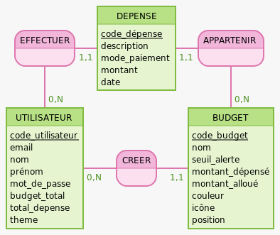

# Modèle Conceptuelle de données (MCD)

Réalisés sur mocodo : https://www.mocodo.net/




```bash
EFFECTUER, 11 DEPENSE, 0N UTILISATEUR
DEPENSE: code_dépense, description, mode_paiement, montant, date
APPARTENIR, 11 DEPENSE, 0N BUDGET

UTILISATEUR: code_utilisateur, email, nom, prénom, mot_de_passe, budget_total, total_depense, theme
CREER, 11 BUDGET, 0N UTILISATEUR
BUDGET: code_budget, nom, seuil_alerte, montant_dépensé, montant_alloué, couleur, icône, position

```