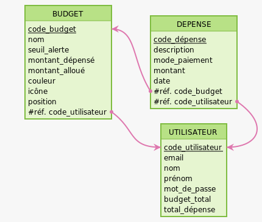

# Modèle Logique de données (MLD)

Réalisés sur mocodo : https://www.mocodo.net/




```bash
:
BUDGET: code_budget, nom, seuil_alerte, montant_dépensé, montant_alloué, couleur, icône, position, #réf. code_utilisateur > UTILISATEUR > code_utilisateur
:
DEPENSE: code_dépense, description, mode_paiement, montant, date, #réf. code_budget > BUDGET > code_budget, #réf. code_utilisateur > UTILISATEUR > code_utilisateur
:

:
:
:
UTILISATEUR: code_utilisateur, email, nom, prénom, mot_de_passe, budget_total, total_dépense
:

```